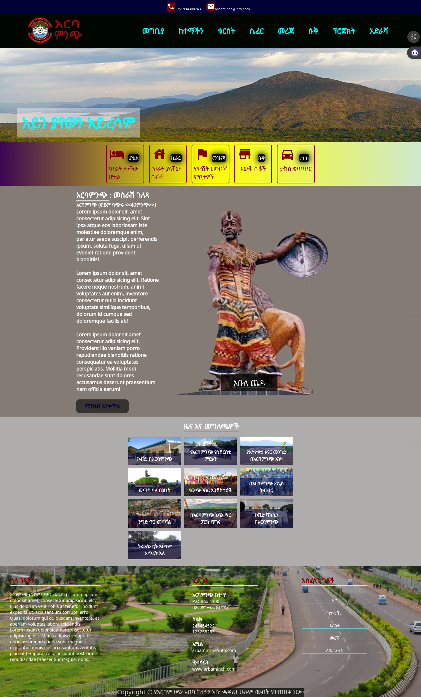

# Ethiopiaweb-Web-Arbaminch

[

# አርባምንጭ ከተማ

This is the official website for አርባምንጭ ከተማ, providing information about the town and its surroundings.

## Table of Contents
- [Introduction](#introduction)
- [Features](#features)
- [Usage](#usage)
- [Contributing](#contributing)
- [License](#license)

## Introduction
This website is designed to showcase the beauty and offerings of አርባምንጭ. Whether you're a resident or a visitor, you'll find valuable information about hotels, tourist attractions, local businesses, news, and more.

## Features
- Responsive design for optimal viewing on various devices.
- Navigation menu for easy access to different sections.
- News section with the latest updates and events.
- Beautiful images highlighting the town's landmarks.
- Contact information for reaching out to አርባምንጭ ከተማ.

## Usage
Feel free to explore the website to discover the richness of አርባምንጭ. The navigation menu provides quick access to different categories, and the news section keeps you informed about current events.

## Contributing 
If you have suggestions, improvements, or would like to contribute to this project, please follow these steps:
1. Fork the repository.
2. Create a new branch.
3. Make your changes.
4. Submit a pull request.

## License
This project is licensed under the [MIT License](LICENSE).

---

**አርባምንጭ ከተማ** | P.O Box 4400, አርባምንጭ, ኢትዮጵያ  
**ስልክ:** 245454522 | 125255255  
**ኢሚል:** arbaminch@info.com  
**ዊብሳይት:** [www.arbaminch.com](https://www.arbaminch.com)
